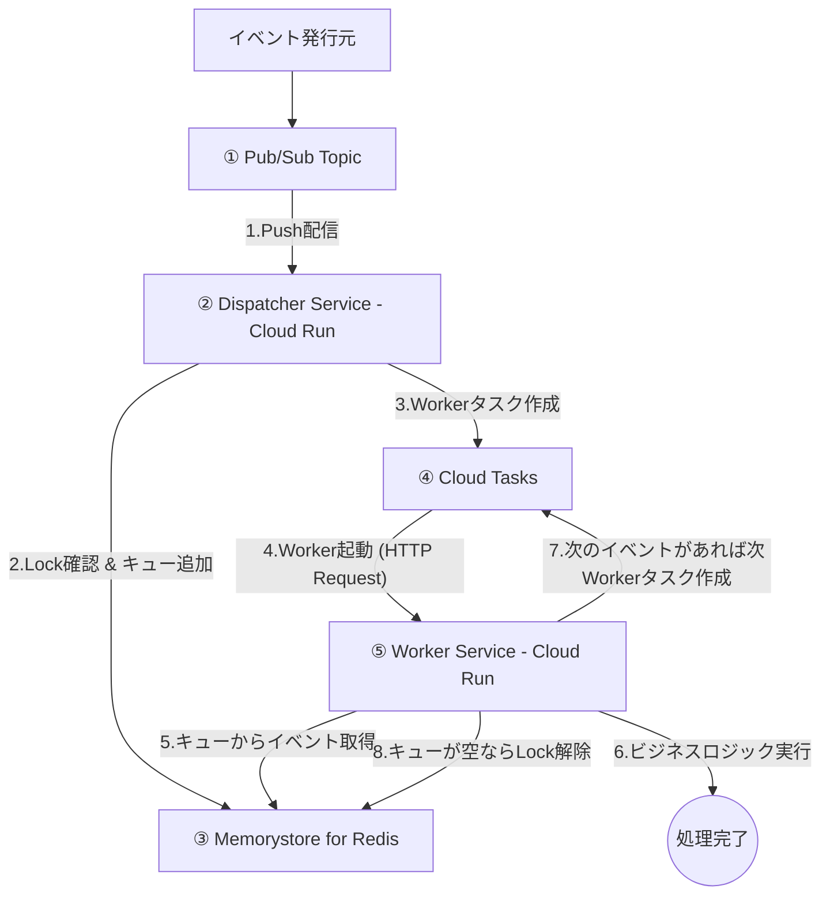

## 概要

ID（キー）に基づいてイベントをグループ化し、異なる ID 間では並列に、同じ ID 内では到着順に直列で処理を行う、ステートフルなイベント処理システムのサンプルプロジェクト

- Pub/Sub の Ordering Key と Redis のキュー機構、 Cloud Tasks を組み合わせて同一キーのイベントを順次処理するサンプル実装
- Redis のキュー機構で atomic な操作を実現するために Lua スクリプトを使用

## アーキテクチャ

1. Pub/Sub: イベント発行元からのイベントを受け取るエントリポイント。 Ordering Key に基づいて Dispatcher にプッシュ配信を行う。
2. Dispatcher: 全てのイベントを受け取り、ID に基づいて Redis 内の適切なキューに格納する。もしその ID の処理が実行されていなければ、Cloud Tasks で Worker タスクを作成する。
3. Worker: 担当する ID のキューからイベントを 1 つ取り出して処理。処理完了後、キューにまだイベントが残っていれば Cloud Tasks で次の Worker タスクを作成。
4. Redis: ID ごとのイベントキューと、処理中であることを示すロック情報を保持する、システムの状態管理の役割を担う。
5. Cloud Tasks: Worker の実行管理を担当し、リトライ機構と信頼性の高いタスク配信を提供する。



## Setup

```bash
npm install && \
npm install --prefix worker && \
npm install --prefix dispatcher
```

## 動作確認

ローカル環境の構築

```bash
docker compose up --build -d
docker compose run --rm setup
```

イベント送信

```bash
docker compose run --rm send
```

worker、dispatcher、cloud-tasks-emulator のログを確認

```bash
docker compose logs -f worker dispatcher cloud-tasks-emulator
```

send によって、worker と dispatcher にログが出力されることを確認

## プロジェクト構成

```text
keyed-sequential-processor-ts-sample/
├── dispatcher/         # イベントを受け取り振り分けるサービス
├── worker/             # イベントを実際に処理するサービス
├── scripts/            # ローカル開発用のセットアップ・テストスクリプト
├── docker-compose.yml  # ローカル開発環境の定義
└── package.json        # ルートパッケージ
```
